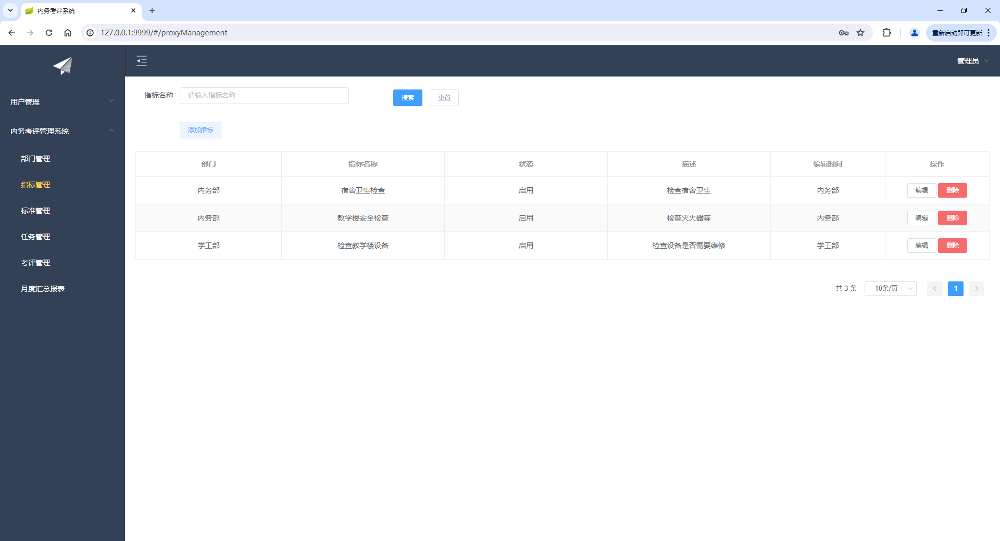
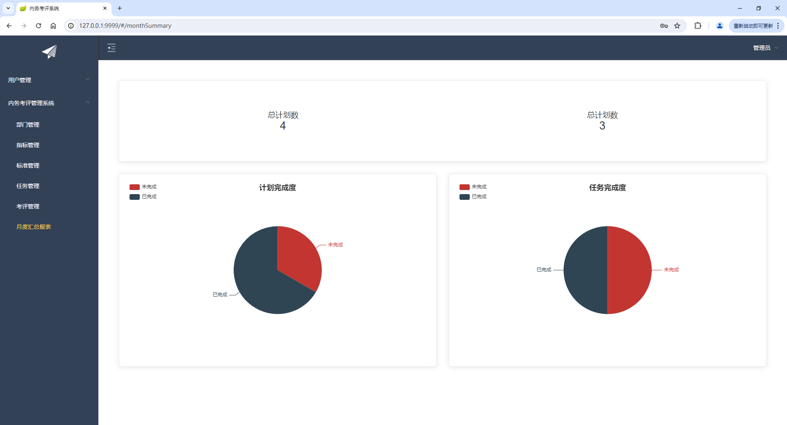
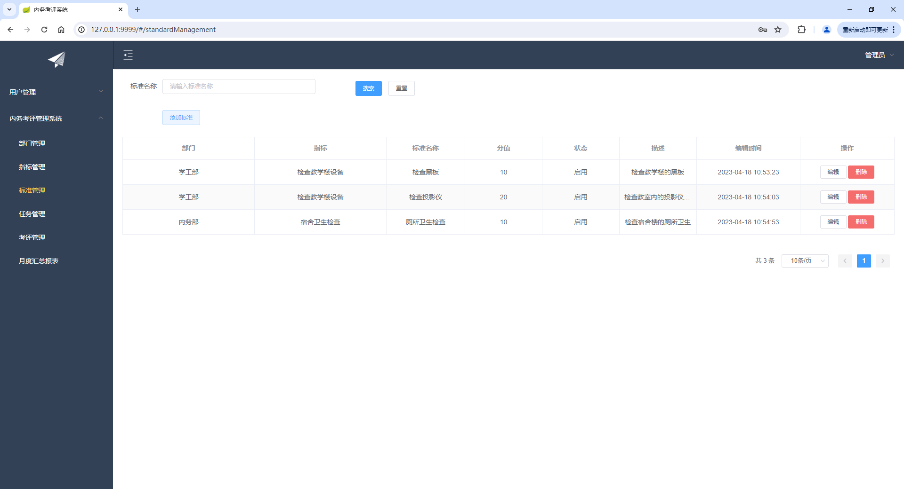
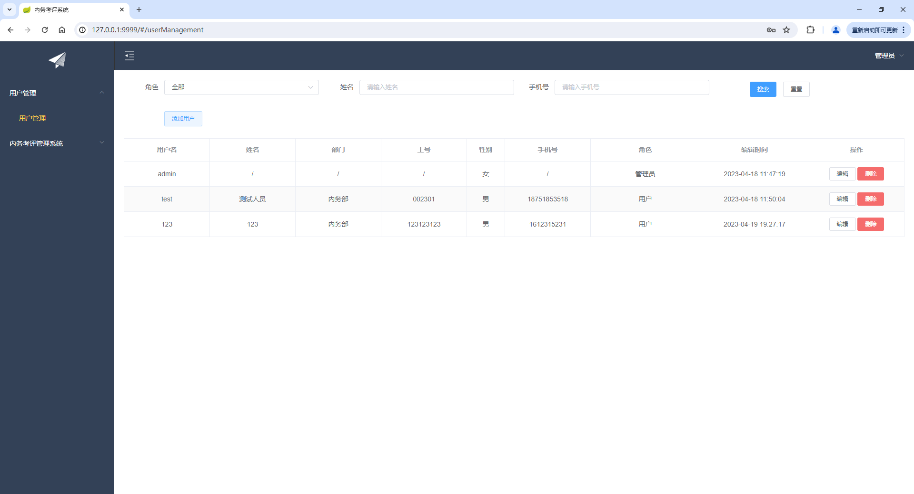
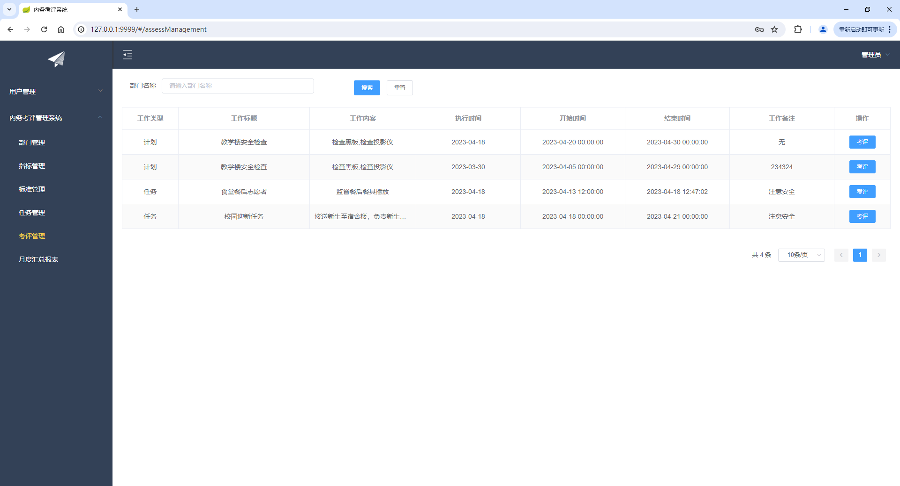
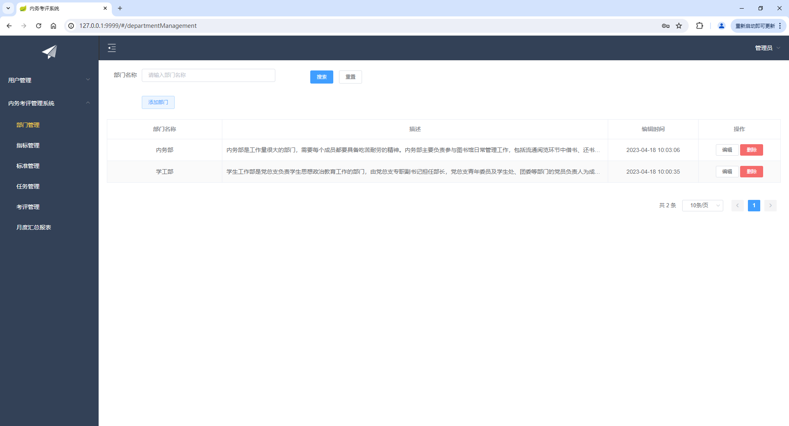
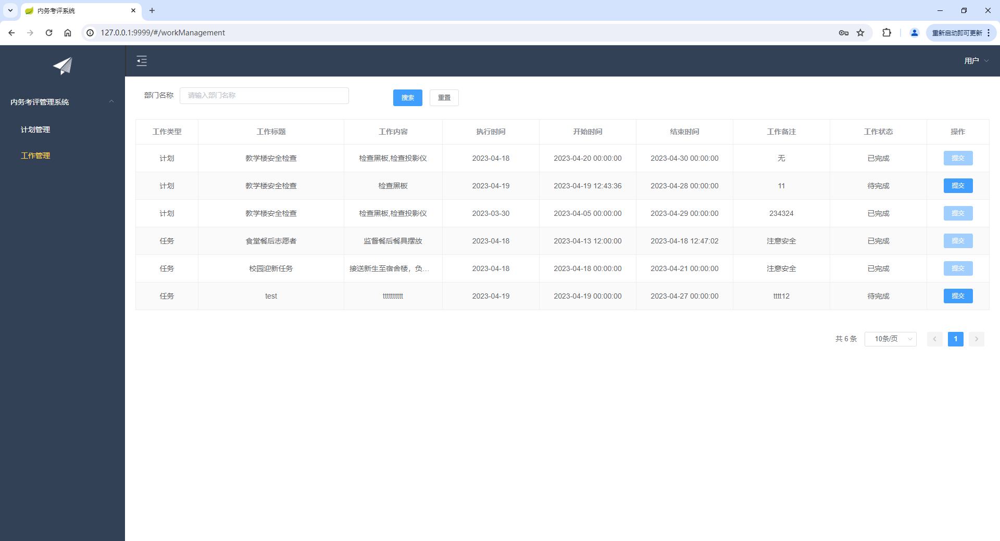
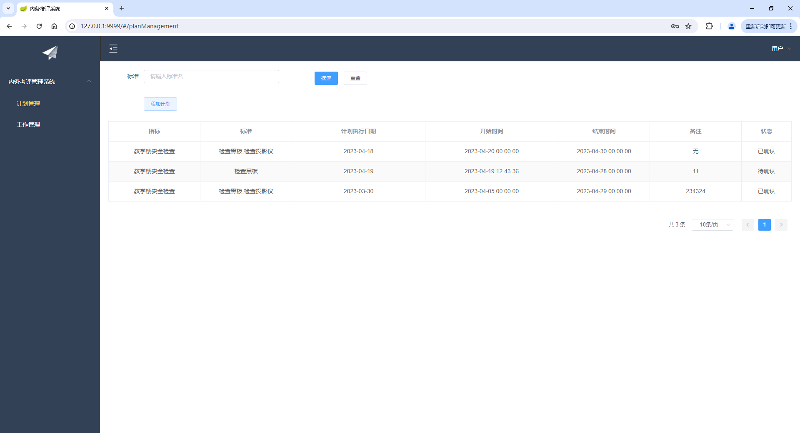

基于Python的大学内务考评系统（程序+论文）
=
- 完整代码获取地址：从戎源码网 ([https://armycodes.com/](https://armycodes.com/))
- 作者微信：19941326836  QQ：952045282
- 承接计算机毕业设计、Java毕业设计、Python毕业设计、深度学习、机器学习
- 选题+开题报告+任务书+程序定制+安装调试+论文+答辩ppt 一条龙服务
- 所有选题地址https://github.com/nature924/allProject

一、项目介绍
---
基于Python Flask框架实现的大学内务考评系统,系统分为前台和后台两大模块，主要功能如下。

### 用户：
- 登录模块：用户登录后，才能使用该系统。
- 个人信息模块：用户修改个人密码。
- 计划管理模块：用户可以添加个人的计划。
- 工作管理模块：用户可以查看自己的任务和计划安排。

### 管理员：
- 用户信息管理板块：管理员可以查找或对用户编辑以及增加新用户。
- 部门管理模块：管理员可以检索部门，并且添加修改和删除部门。
- 指标管理模块：管理员可以检索指标，并且添加修改和删除指标。
- 标准管理模块：管理员可以检索标准，并且添加修改和删除标准。
- 任务管理模块：管理员可以检索任务，并且添加修改和删除任务。
- 考评管理模块：管理员可以检索考评，并且添加修改和删除考评。
- 月度汇总报表模块：管理员可以查看当前系统的任务完成度和计划完成度。

二、项目技术
---
- 编程语言：Python
- 项目架构：B/S架构
- 前端技术：ElementUI、Vue、Vuex、Axios、Vue-Router
- 后端技术：MySQL、Python、Flask、jieba，cnsenti

三、运行环境
---
- 操作系统：Windows、macOS都可以
- Python版本：3.7及以上都可以
- 操作系统：Windows7/10、MacOS
- 开发工具：IDEA、Ecplise、MyEclipse都可以
- 数据库: MySQL5.5/5.7/8.0版本都可以

四、运行截图
---

### 程序截图：
- 管理端
  
  
  
  
  
  
  
  

- 用户端
  
  